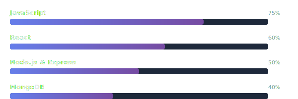
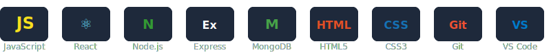

  

 

  
  
  

 

## About Me

> *"The only way to learn a new programming language is by writing programs in it."*
> — Dennis Ritchie

I'm an **aspiring Full Stack Developer** on a focused journey to master the **MERN stack**.

| | |
|---|---|
| **Current Focus** | Deep-diving into React, Node.js, Express & MongoDB |
| **Philosophy** | Clean code, real projects, continuous learning |
| **Mindset** | Every project is an opportunity to grow |
| **Open To** | Collaborations, mentorship & developer connections |

 

## Learning Progress

  

 

## Tech I'm Working With

  

## Let's Connect

I'm always excited to connect with other developers, share knowledge, and learn together. Feel free to reach out!

  
  
  

 

  

