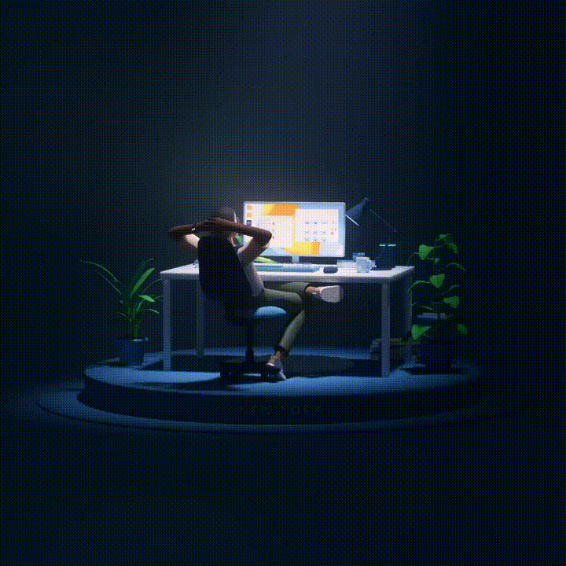

  

 

  
  
  

 

## About Me

> *"The only way to learn a new programming language is by writing programs in it."*
> — Dennis Ritchie

I'm an **aspiring Full Stack Developer** on a focused journey to master the **MERN stack**.

| | |
|---|---|
| **Current Focus** | Deep-diving into React, Node.js, Express & MongoDB |
| **Philosophy** | Clean code, real projects, continuous learning |
| **Mindset** | Every project is an opportunity to grow |
| **Open To** | Collaborations, mentorship & developer connections |

 

## Learning Progress

  

 

## Tech I'm Working With

  

## Let's Connect

  <table>
    <tr>
      <td align="center" width="200">
        
         
        <b>Drop me a message</b>
      </td>
      <td align="center" width="200">
        
         
        <b>Let's network</b>
      </td>
      <td align="center" width="200">
        
         
        <b>Follow my journey</b>
      </td>
    </tr>
  </table>
  
   
  
  <i>Open for collaborations, mentorship, and building cool stuff together.</i>

 

  

