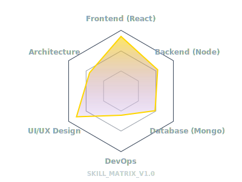

  

 

  <h3>🚀 Mission Status: LEARNING & BUILDING</h3>
  
An aspirational <b>Full Stack Developer</b> architecting the future of the web. Mastering the MERN stack one commit at a time.

 

| **SYSTEM CAPABILITIES** | **OPERATIONAL METRICS** |
| :---: | :---: |
|  |  |
| *Holographic Skill Matrix v1.0* | *Live GitHub Telemetry* |

 

  <h3>🛠 LOADED MODULES</h3>
   
  
  
  
  
  
  
    
  
  
  
  

 

  

 

  
  

