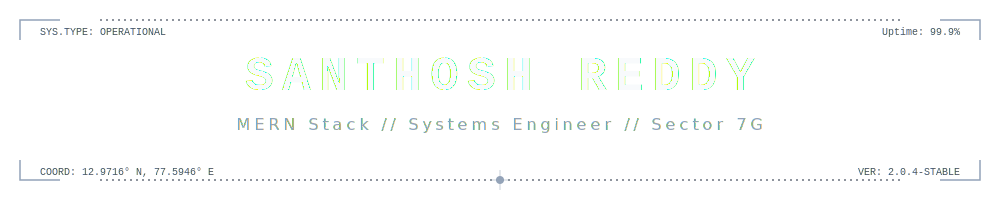

  

  

---

### 🛡️ OPERATIVE DIRECTIVE
> **"Consistent execution is the baseline. Craftsmanship is the requirement. This is the way."**

I engineer high-performance systems with the MERN stack. My methodology bridges technical discipline with premium design aesthetics to create software that doesn't just work—it commands attention.

---

### 📦 BOUNTY BOARD (Active Projects)

| STATUS | OBJECTIVE | LOADOUT |
| :--- | :--- | :--- |
| **NOMINAL** | **[THE-HUSTLE-PLANNER](https://github.com/santjsx/The-Hustle-Planner)** | `Mongo` `Express` `React` `Node` |
| **NOMINAL** | **[GTAV-PORTFOLIO](https://github.com/santjsx/GTAV-Portfolio)** | `JS` `Tailwind` `Framer-Motion` |
| **ACTIVE** | **[SANTJSX-CORE](https://github.com/santjsx)** | `System Architecture` `Minimalism` |

---

### 📜 SYSTEMS LOG
- **MODULARITY**: Build systems, not just features.
- **INTEGRITY**: Code that withstands scrutiny.
- **RUTHLESS MINIMALISM**: Remove the noise until only excellence remains.

---

### 📡 SECURE TRANSMISSIONS

  
  
  

  

  
  

