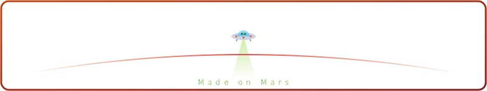

  

  

---

### /// THE OATH
> **"Words are wind. True power lies in the architecture of the realm. This is the way."**

I forge high-performance systems wielding the MERN stack. My methodology bridges the discipline of an ancient order with the elegance of premium design to craft software that commands the Seven Kingdoms of the Web.

---

### /// REALM QUESTS (Active Campaigns)

| STATUS | CAMPAIGN | WEAPONRY |
| :--- | :--- | :--- |
| **VICTORIOUS** | **[THE-HUSTLE-PLANNER](https://github.com/santjsx/The-Hustle-Planner)** | `Mongo` `Express` `React` `Node` |
| **VICTORIOUS** | **[GTAV-PORTFOLIO](https://github.com/santjsx/GTAV-Portfolio)** | `JS` `Tailwind` `Framer-Motion` |
| **MARCHING** | **[SANTJSX-CORE](https://github.com/santjsx)** | `Grand Strategy` `Steel Minimalism` |

---

### /// THE MAESTER'S LOG
- **STRENGTH**: Build fortresses, not just walls.
- **HONOR**: Code that withstands the longest winters.
- **RUTHLESSNESS**: Strike down complexity; leave only excellence.

---

### /// SEND A RAVEN

  
  
  

  

  
  

